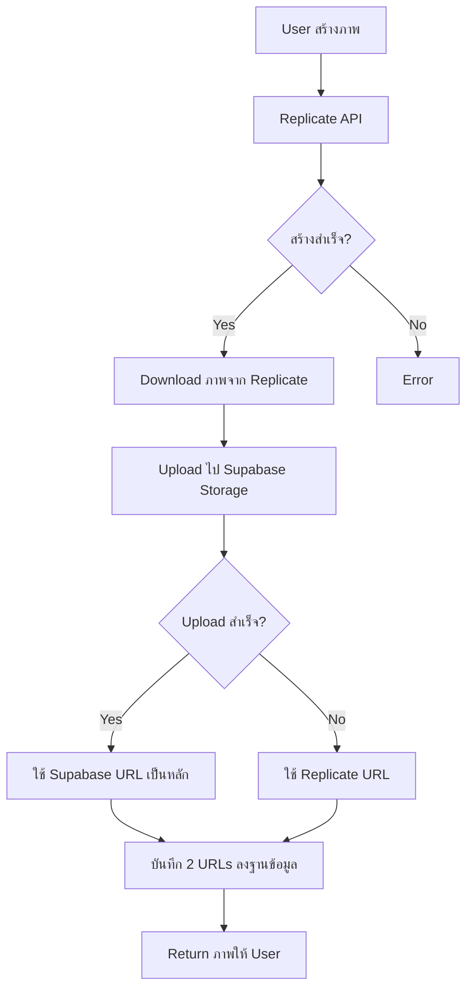

# 📦 Supabase Storage Feature - เพิ่มสำเร็จ!

## 🎯 สิ่งที่เพิ่มเข้ามา

ระบบ **Upload ภาพแบนเนอร์ไป Supabase Storage** พร้อมใช้งานแล้ว!

---

## ✨ ฟีเจอร์ใหม่

### ก่อน (เฉพาะ Replicate URL)
```
1. สร้างภาพจาก Replicate ✅
2. ได้ URL ชั่วคราวจาก Replicate
3. URL อาจหมดอายุ ❌
4. บันทึกไม่ได้ (ไม่มี Supabase) ❌
```

### หลัง (มี Supabase Storage)
```
1. สร้างภาพจาก Replicate ✅
2. Download ภาพจาก Replicate
3. Upload ไป Supabase Storage ✅
4. ได้ Public URL ถาวรจาก Supabase ✅
5. บันทึก 2 URLs (Supabase + Replicate) ✅
6. เก็บไว้ใช้ได้ตลอดไป ✅
```

---

## 📁 ไฟล์ที่สร้าง/แก้ไข

### ไฟล์ใหม่ (Created)

1. **`supabase/migrations/003_setup_storage.sql`**
   - สร้าง Storage Bucket "banners"
   - ตั้งค่า Policies (Public Read, Authenticated Upload)
   - Helper Functions (get_user_storage_usage, cleanup_old_files)

2. **`SUPABASE_STORAGE_SETUP.md`**
   - คู่มือตั้งค่า Storage ฉบับเต็ม
   - Policies, CORS, Troubleshooting

3. **`STORAGE_QUICK_START.md`**
   - Quick Start Guide - เริ่มใน 5 นาที!
   - ขั้นตอนละเอียด พร้อมตัวอย่าง

4. **`STORAGE_FEATURE_ADDED.md`**
   - เอกสารนี้ - สรุปฟีเจอร์ที่เพิ่ม

### ไฟล์แก้ไข (Modified)

1. **`app/api/ai/banner/route.ts`**
   ```typescript
   // เพิ่ม:
   - Download image from Replicate
   - Upload to Supabase Storage
   - Get public URL
   - Save both URLs to database
   ```

2. **`supabase/migrations/002_create_content_and_banners.sql`**
   ```sql
   -- เพิ่ม column:
   replicate_url text  -- สำรอง URL จาก Replicate
   ```

3. **`UPDATE_NANO_BANANA_PRO.md`**
   - อัปเดตสรุปให้รวม Storage feature

---

## 🔄 Flow การทำงาน



---

## 🗄️ Database Schema (อัปเดต)

### ตาราง `banners`

```sql
CREATE TABLE banners (
  id uuid PRIMARY KEY,
  user_id uuid REFERENCES auth.users,
  prompt text NOT NULL,
  
  -- URLs (ใหม่!)
  image_url text NOT NULL,      -- Supabase Storage (หลัก)
  replicate_url text,            -- Replicate (สำรอง)
  
  resolution text DEFAULT '2K',
  aspect_ratio text DEFAULT '16:9',
  created_at timestamp DEFAULT now(),
  updated_at timestamp DEFAULT now()
);
```

### Storage Structure

```
Storage Bucket: banners/
├── {user_id}/
│   └── {timestamp}_{resolution}_{aspect_ratio}.{format}
│
Example:
banners/
  └── 550e8400-e29b-41d4-a716-446655440000/
      ├── 1735303200000_2K_16-9.png
      ├── 1735303300000_4K_1-1.jpg
      └── 1735303400000_2K_3-4.webp
```

---

## 📊 API Response (ใหม่)

### Before
```json
{
  "imageUrl": "https://replicate.delivery/pbxt/...",
  "saved": false,
  "error": "สร้างภาพสำเร็จ แต่ไม่สามารถบันทึกได้"
}
```

### After
```json
{
  "imageUrl": "https://project.supabase.co/storage/v1/object/public/banners/user-id/timestamp_2K_16-9.png",
  "replicateUrl": "https://replicate.delivery/pbxt/...",
  "saved": true,
  "uploadedToStorage": true,
  "id": "uuid-here",
  "resolution": "2K",
  "aspect_ratio": "16:9"
}
```

---

## 🛡️ Security & Policies

### Storage Policies

| Policy | ใครทำได้ | ทำอะไร |
|--------|----------|--------|
| Public Read | ทุกคน | ดู/ดาวน์โหลดภาพ |
| Authenticated Upload | ผู้ใช้ที่ login | Upload ภาพใหม่ |
| Update Own | เจ้าของเท่านั้น | แก้ไขภาพของตัวเอง |
| Delete Own | เจ้าของเท่านั้น | ลบภาพของตัวเอง |

### File Organization

- แต่ละ user มี folder ของตัวเอง
- ไม่สามารถแก้ไข/ลบไฟล์ของคนอื่น
- Public URL แต่ควบคุมการ upload/delete

---

## 💡 Helper Functions

### 1. ดูการใช้งาน Storage

```sql
SELECT * FROM get_user_storage_usage('user-uuid');

-- Result:
-- file_count | total_size_mb
-- -----------+--------------
--          5 |         12.45
```

### 2. ลบไฟล์เก่า (> 90 วัน)

```sql
SELECT cleanup_old_banner_files(90);

-- Result: จำนวนไฟล์ที่ลบ
```

---

## 🎯 ข้อดี

| ฟีเจอร์ | ก่อน | หลัง |
|---------|------|------|
| URL Lifetime | ❌ ชั่วคราว | ✅ ถาวร |
| Storage Control | ❌ ไม่มี | ✅ ควบคุมได้เต็มที่ |
| CDN | ❌ ไม่มี | ✅ Supabase CDN |
| Backup | ❌ ไม่มี | ✅ มี 2 URLs |
| Organization | ❌ ไม่มี | ✅ แยกตาม user_id |
| Privacy | ❌ Public เท่านั้น | ✅ ควบคุม Policies ได้ |

---

## 📋 ขั้นตอนติดตั้ง

### Quick Start (5 นาที)

1. **รัน Migration**
   ```sql
   -- ใน Supabase SQL Editor:
   -- 1. รัน supabase/migrations/002_*.sql
   -- 2. รัน supabase/migrations/003_*.sql
   ```

2. **ตรวจสอบ Bucket**
   - เข้า Storage → ต้องมี "banners"

3. **Restart Server**
   ```bash
   npm run dev
   ```

4. **ทดสอบ!**
   - สร้างภาพแบนเนอร์
   - เช็คใน Storage → มีไฟล์

---

## 📚 เอกสารที่เกี่ยวข้อง

| เอกสาร | คำอธิบาย |
|--------|----------|
| `STORAGE_QUICK_START.md` | Quick Start - เริ่มใน 5 นาที ⚡ |
| `SUPABASE_STORAGE_SETUP.md` | คู่มือฉบับเต็ม 📖 |
| `BANNER_FEATURE.md` | รายละเอียดฟีเจอร์แบนเนอร์ |
| `UPDATE_NANO_BANANA_PRO.md` | อัปเดต Nano Banana Pro |

---

## 🚀 สรุป

### สิ่งที่ได้รับ

✅ **Upload System** - อัปโหลดภาพไป Supabase  
✅ **Permanent URLs** - URL ที่ไม่หมดอายุ  
✅ **Backup System** - มี 2 URLs (Supabase + Replicate)  
✅ **User Organization** - แยก folder ตาม user  
✅ **Storage Policies** - ควบคุมการเข้าถึง  
✅ **Helper Functions** - จัดการ storage ง่าย  
✅ **Complete Docs** - เอกสารครบถ้วน  

### การทำงาน

1. ✅ Replicate สร้างภาพ
2. ✅ Download ภาพ
3. ✅ Upload ไป Supabase Storage
4. ✅ ได้ Public URL ถาวร
5. ✅ บันทึก 2 URLs
6. ✅ User ดาวน์โหลดได้ตลอดไป

---

## 🎉 **Feature Complete!**

ฟีเจอร์สร้างภาพแบนเนอร์ตอนนี้:
- 🍌 ใช้ Google Nano Banana Pro
- 📤 Upload ไป Supabase Storage
- 💾 เก็บถาวร ไม่หมดอายุ
- 🔒 ปลอดภัย มี Policies
- 📊 จัดการง่าย มี Helper Functions
- 📚 เอกสารครบ Ready to use!

**พร้อมใช้งานจริง Production!** 🚀✨

